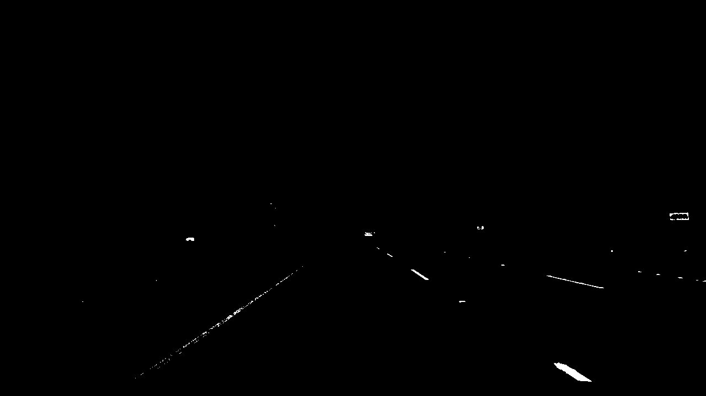
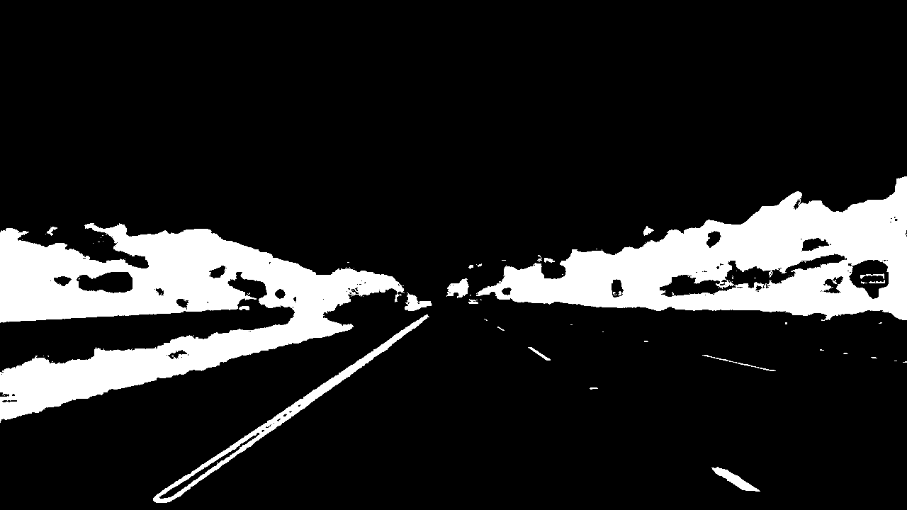

In this project, Goal is to write a software pipeline to identify the lane boundaries in a video, and create a detailed writeup of the project. This project is a part of udacity's [Self Driving Car Nanodegree](https://in.udacity.com/course/self-driving-car-engineer-nanodegree--nd013)


# **Advanced Lane Finding Project**
### **Author : Shankar Rao Pandala** 

The goals / steps of this project are the following:

- Compute the camera calibration matrix and distortion coefficients given a set of chessboard images.
- Apply a distortion correction to raw images.
- Use color transforms, gradients, etc., to create a thresholded binary image.
- Apply a perspective transform to rectify binary image ("birds-eye view").
- Detect lane pixels and fit to find the lane boundary.
- Determine the curvature of the lane and vehicle position with respect to center.
- Warp the detected lane boundaries back onto the original image.
- Output visual display of the lane boundaries and numerical estimation of lane curvature and vehicle position.

# Camera Calibration


Camera calibration is the process of estimating parameters of the camera using images of a special calibration pattern. The parameters include camera intrinsics, distortion coefficients, and camera extrinsics. This information is then used to remove distortions caused by that camera. 
We use two lists ```objpoints```, which contains the rbitrary points on a real-world objects and ```imgpoints``` contains the coordinates of the same points in camera images of the object. In this project, we use chessboard calibration images provided by Udacity in the directory ```camera_cal```. Object points were generated with 9 internal corners in the horizontal direction and 6 in the vertical direction in every image and corresponding image points were obtained by calling ```cv2.findChessboardCorners()``` and then both object points and image points are passed to ```cv2.calibrateCamera()``` to calibrate the camera.

```
def camera_calibration(images, nx, ny, show=False):
    # prepare object points, like (0,0,0), (1,0,0), (2,0,0) ....,(6,4,0),(6,5,0),...
    objp = np.zeros((nx*ny,3), np.float32)
    objp[:,:2] = np.mgrid[0:nx,0:ny].T.reshape(-1,2)

    # Make a list of calibration images
    images = glob.glob(images)

    # Step through the list and search for chessboard corners
    for image in tqdm(images):
        
        img = cv2.imread(image)
        corner_img = np.copy(img)
    
        gray = cv2.cvtColor(img,cv2.COLOR_BGR2GRAY)
    
        # Find the chessboard corners
        ret, corners = cv2.findChessboardCorners(gray, (nx,ny),None)
    
        # If found, add object points, image points
        if ret == True:
            objpoints.append(objp)
            imgpoints.append(corners)

            if show:
                # Draw and display the corners
                cv2.drawChessboardCorners(corner_img, (nx,ny), corners, ret)
                f, (ax1, ax2) = plt.subplots(1, 2, figsize=(10,5))
                ax1.imshow(cv2.cvtColor(img, cv2.COLOR_BGR2RGB))
                ax1.set_title('Original Image')
                ax2.imshow(cv2.cvtColor(corner_img, cv2.COLOR_BGR2RGB))
                ax2.set_title('Image With Corners')
        ret, mtx, dist, rvecs, tvecs = cv2.calibrateCamera(objpoints, imgpoints, gray.shape[::-1], None, None)
    return mtx, dist``` 

## Distortion Correction

distortion correction to the test image using the cv2.undistort() function and obtained this result:

<tr>
    <td> <h2 align='center'>Original Image</h2> </td>
    <td> <h2 align='center'>Undistorted Image</h2> </td>
    </tr>
<tr>
    <td>  </td>
    <td>  </td>
    </tr>


# Pipeline

## Distortion Correction for test Images

Similar to undistort with the chessboard image, I have undistorted the test images using ```cv2.undistort()```
Here is an example of orginal and undistorted image:

<tr>
    <td> <h2 align='center'>Original Image</h2> </td>
    <td> <h2 align='center'>Undistorted Image</h2> </td>
    </tr>
<tr>
    <td>  </td>
    <td>  </td>
    </tr>


## color transforms, gradients or other methods to create a thresholded binary image

RGB space do not correspond well to perceived differences in color. That is, two colors can be close in RGB space but appear very different to humans and vice versa. This is the reason we use non-RGB colorspaces, including LUV, in computer vision.

As a part of LUV color space, A combination of B & L channel for creating a thresholded binary image.

The B channel from the Lab color space, with a min threshold of 140 and an upper threshold of 200, did a better job than the S channel in identifying the yellow lines, but completely ignored the white lines.

The L Channel from the LUV color space, with a min threshold of 200 and a max threshold of 255, did an almost perfect job of picking up the white lane lines, but completely ignored the yellow lines.


<tr>
    <td> <h2 align='center'>Original Image</h2> </td>
    <td> <h2 align='center'>B Channel</h2> </td>
    <td> <h2 align='center'>L Channel</h2> </td>
    <td> <h2 align='center'>Binary Image</h2> </td>
    </tr>
<tr>
    <td>  </td>
    <td>  </td>
    <td>  </td>
    <td>  </td>
    </tr>


## Perspective transform

When human eyes see near things they look bigger as compare to those who are far away. This is called perspective in a general way. Whereas transformation is the transfer of an object e.t.c from one state to another.

So overall, the perspective transformation deals with the conversion of 3d world into 2d image. The same principle on which human vision works and the same principle on which the camera works

Code is provided in the Project P2- Advanced Lane Detection ipython Notebook submitted as part of the project
Below is the sample of original Image and Prespective transformed Image

<tr>
    <td> <h2 align='center'>Original Image</h2> </td>
    <td> <h2 align='center'>Perspective transformed Image</h2> </td>
    </tr>
<tr>
    <td>  </td>
    <td>  </td>
    </tr>

## Identify lane-line pixels and fit their positions with a polynomial

After perspective transformation lanes are indetified using functions ```find_window_centroids``` and ```draw_centroids```

If no informtion about lane pixels in the previous frame is passed to this function it uses a histogram of bright pixel counts to identify the bases of the lanes in the lower half of the binary mask, followed by sliding window search to identify the rest of the lanes.

On the other hand if poynomials describing the position of the lanes in the previous frame are passed to this function, it searches only in a narrow region around the previous lanes. The image below shows how lane search is performed in the former case.

Below is an example of image with fitted lane line:

<tr>
    <td> <h2 align='center'>Perspective transformed Image</h2> </td>
    <td> <h2 align='center'>poly fit Image</h2> </td>
    </tr>
<tr>
    <td>  </td>
    <td>  </td>
    </tr>

## Calculate the radius of curvature of the lane 

```np.polyfit``` is used to calclulate the curvature of the lane lines in the images.
The same has been provided in the Project P2- Advanced Lane Detection ipython Notebook submitted as part of the project.

## example image of result plotted back down onto the road such that the lane area is identified clearly

<tr>
    <td> <h2 align='center'>Original Image</h2> </td>
    <td> <h2 align='center'>Lane Identified</h2> </td>
    </tr>
<tr>
    <td>  </td>
    <td>  </td>
    </tr>

## Final video output


```python
from IPython.display import HTML
HTML("""
        <video width="960" height="540" controls>
        <source src="{0}">
        </video>
    """.format('project_video_output.mp4'))
```


        <video width="960" height="540" controls>
        <source src="project_video_output.mp4">
        </video>
    


## Discussion

Though the lanes detected in ```project_video.mp4``` looks good. This may not the same scenario in other videos
There are improvements necessary in the approach like 

- Lighting conditions, fog, rainydays etc will impact the detection and this may fail.
- Shadows are creating lots of problem in the ```project_video.mp4``` 
- If the curvature is too long like S curve this may not work well


```python

```
